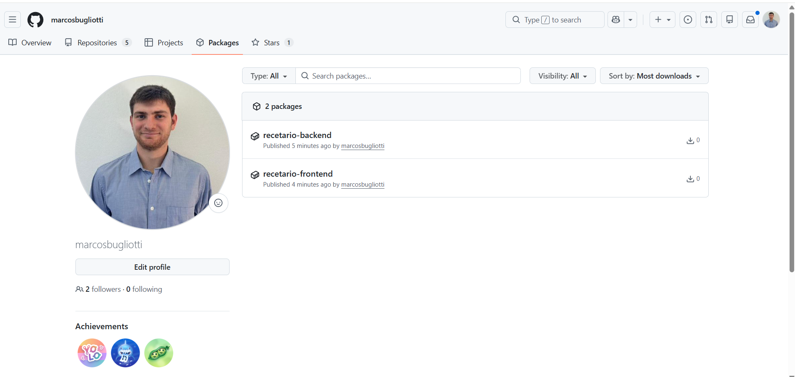

# Evidencias — TP1

## 1. Push directo a main rechazado

GitHub rechaza el push porque main está protegida y la regla alcanza también al dueño del repo
(`GH006: Protected branch update failed`, `protected branch hook declined`).

## 2. El PR de la rama B no se puede mergear: conflicto

GitHub detecta que ambas ramas modificaron la misma línea del README y no puede mergear automáticamente.

## 3. Marcadores de conflicto

Los marcadores `<<<<<<<`, `=======` y `>>>>>>>` delimitan las dos versiones en pugna antes de resolver el conflicto. Se resolvió localmente en VS Code (`git merge origin/main` sobre la rama `feature/titulo-b`) en vez del editor web, pero el resultado es el mismo: hay que decidir a mano qué contenido queda.

## 4. Release v1.0.0 publicada

Tag `v1.0.0` sobre `main` con la release publicada y sus notas.

## TP2 — Contenedores

> Checklist armado según lo que pide el enunciado (§"Trabajo Práctico 02"). Cada punto se completacon capturas/salidas reales después de correr los comandos del `README.md` — no se pueden generar sin correr Docker de verdad.

### 1. Arranque desde cero
- [x] Captura de `docker compose up -d --build` corriendo limpio (build sin cache, tras `docker compose down --rmi local` + `docker builder prune -af`).

Arranca el build multi-stage de las dos imágenes (backend y frontend) desde cero.

Resultado final: las dos imágenes se buildean (`Built`), la base queda `Healthy`, y backend y frontend quedan `Started` — todo con un solo comando.

- [x] Captura de `docker compose ps` mostrando `db` healthy y `backend`/`frontend` running.

Los 3 servicios arriba: `db` en `healthy`, `backend` y `frontend` en `running`, con sus puertos publicados (`8000` y `3000`).

- [x] Captura del frontend funcionando en `http://localhost:3000` (crear una receta, verla en el listado).

Receta real ("Flan de leche condensada") creada desde la UI servida por nginx en el puerto 3000, con sus ingredientes y el escalado de porciones funcionando.

### 2. Prueba de persistencia
- [x] `docker compose down && docker compose up -d`, y captura confirmando que los datos siguen ahí (por ejemplo `curl http://localhost:8000/api/recipes` con la receta creada antes).

`docker compose down` (sin `-v`) y `docker compose up -d` de nuevo — el volumen de la base no se tocó.

La receta "Flan de leche condensada" sigue estando ahí después del reinicio: los datos sobrevivieron porque viven en el volumen nombrado `db_data`, no en el contenedor.

- [x] `docker compose down -v && docker compose up -d`, y captura confirmando que ahora está vacío.

Esta vez `docker compose down -v` también borra el volumen (`Volume ... Removed`), y al hacer `up -d` de nuevo se crea uno completamente vacío (`Volume ... Created`).

La misma receta ya no existe ("Receta no encontrada") y la sesión se cerró sola (el usuario tampoco existe más) — confirma que `-v` borra los datos de verdad, a diferencia de un `down` común.

### 3. Comparación de tamaño de imágenes
- [x] Captura de `docker images` comparando `python:3.12-slim` (base) vs. la imagen final del backend, y `node:22-alpine` vs. la imagen final del frontend.

| Imagen | Content size |
|---|---|
| `python:3.12-slim` | 45.4MB |
| `ingsoft3-tp01-bugliotti-backend` (final) | 74.2MB |
| `node:22-alpine` | 58.1MB |
| `ingsoft3-tp01-bugliotti-frontend` (final) | 26.1MB |

En el **frontend** se ve clarísimo el ahorro del multi-stage: la imagen final (26.1MB) pesa menos de la mitad que `node:22-alpine` (58.1MB), porque la imagen final no lleva Node ni `npm` ni el código fuente — solo nginx y los estáticos ya compilados.

En el **backend** el número es distinto pero no es un problema: la imagen final (74.2MB) pesa más que `python:3.12-slim` sola (45.4MB) porque a la base se le suman las dependencias instaladas (FastAPI, SQLAlchemy, `cryptography`, `psycopg2`, etc.). El ahorro del multi-stage acá no se ve comparando contra la base pelada, sino contra lo que pesaría si la imagen final también cargara con `pip` y el cache de instalación (que es justo lo que la etapa final *no* copia — solo copia `/usr/local` con el resultado ya instalado). Como ninguna dependencia necesita compilarse (`psycopg2-binary` viene precompilado), acá no hace falta ni un compilador de por medio.

### 4. Imágenes publicadas
- [x] Captura de las imágenes visibles en la pestaña *Packages* de tu perfil de GitHub, en público.

Las dos imágenes (`recetario-backend`, `recetario-frontend`) publicadas en la pestaña *Packages* del perfil, con tag `v0.1.0`.

- [x] Captura de `docker compose -f docker-compose.registry.yml up -d` bajando las imágenes (sin buildear) y levantando el sistema.

La prueba real de que quedaron públicas: después de `docker logout`, borrar las imágenes locales y vaciar el cache de build, `docker compose -f docker-compose.registry.yml up -d` las descarga igual (`Image ... Pulled`, sin ningún error de autenticación) y levanta el sistema completo con ellas — sin construir nada, sin estar logueado.
