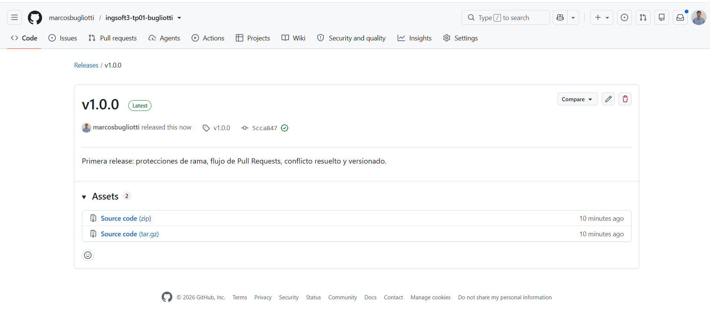

# Evidencias — TP1

## 1. Push directo a main rechazado

GitHub rechaza el push porque main está protegida y la regla alcanza también al dueño del repo
(`GH006: Protected branch update failed`, `protected branch hook declined`).

## 2. El PR de la rama B no se puede mergear: conflicto

GitHub detecta que ambas ramas modificaron la misma línea del README y no puede mergear
automáticamente.

## 3. Marcadores de conflicto

Los marcadores `<<<<<<<`, `=======` y `>>>>>>>` delimitan las dos versiones en pugna antes de
resolver el conflicto. Se resolvió localmente en VS Code (`git merge origin/main` sobre la rama
`feature/titulo-b`) en vez del editor web, pero el resultado es el mismo: hay que decidir a mano
qué contenido queda.

## 4. Release v1.0.0 publicada

Tag `v1.0.0` sobre `main` con la release publicada y sus notas.
